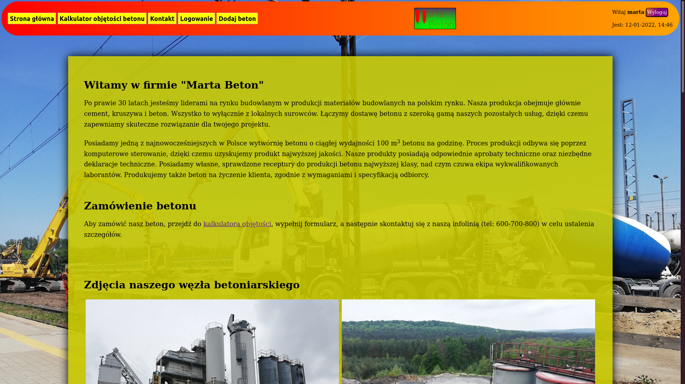
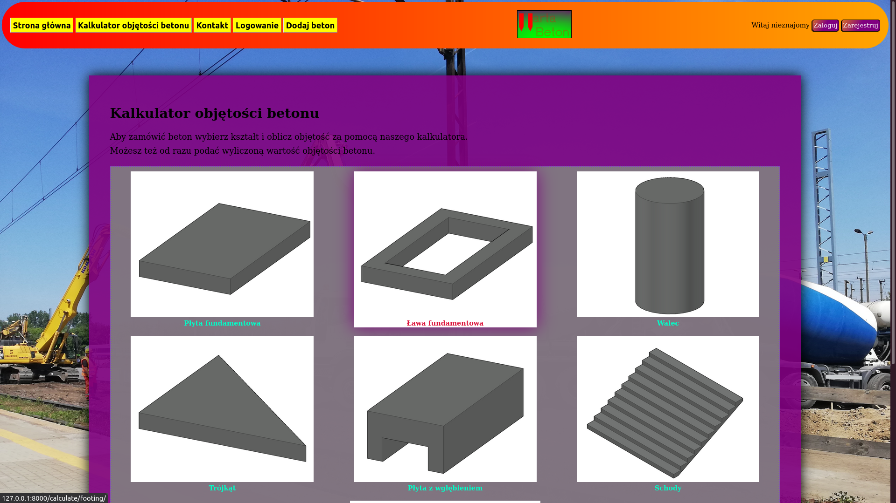
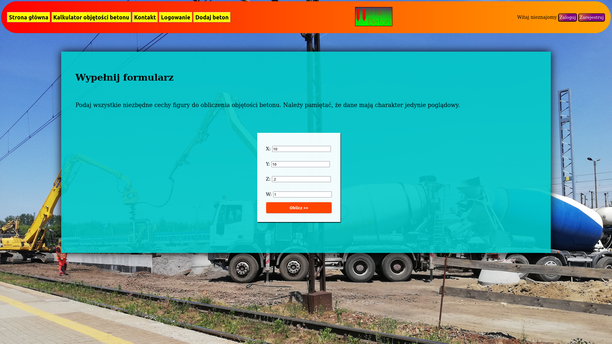
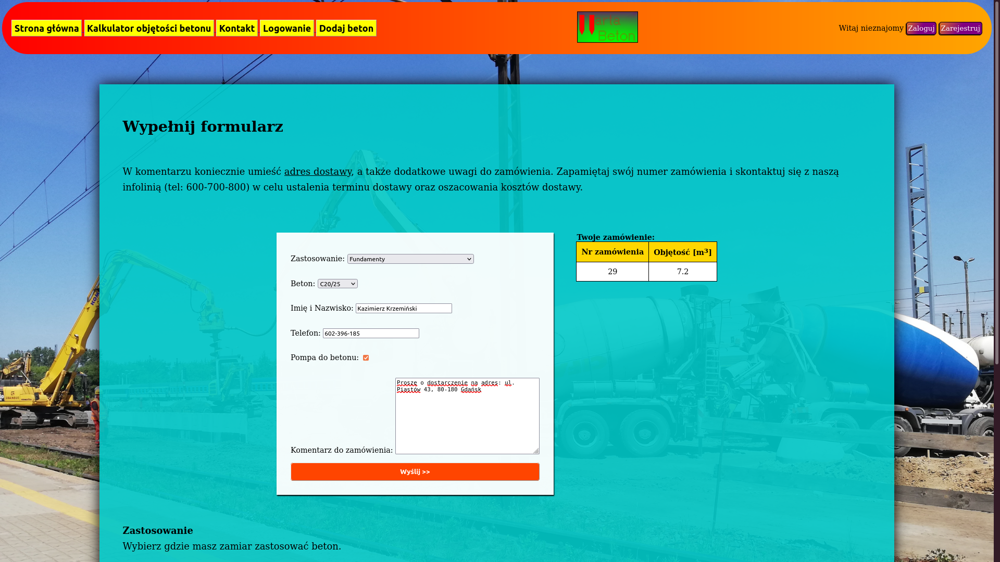
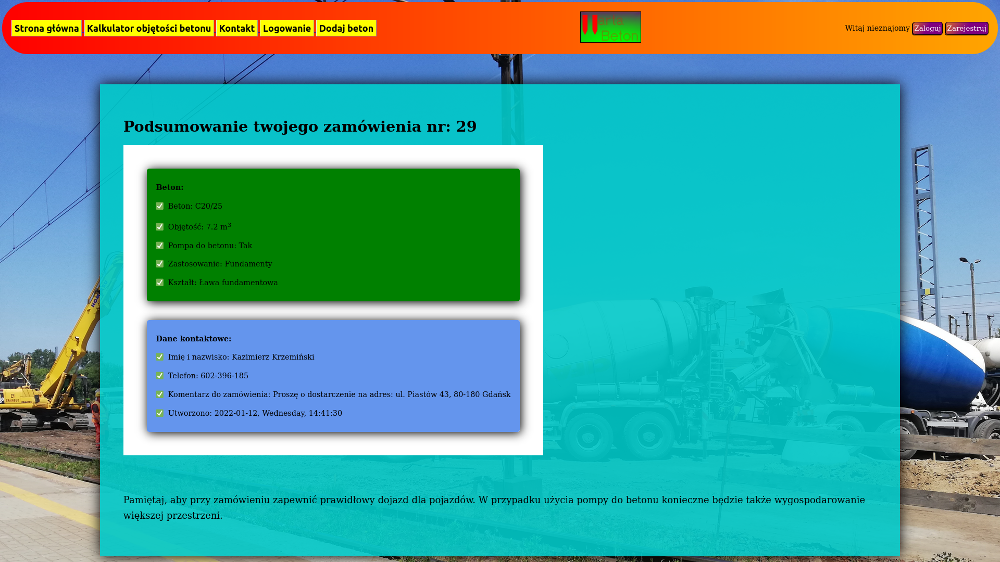
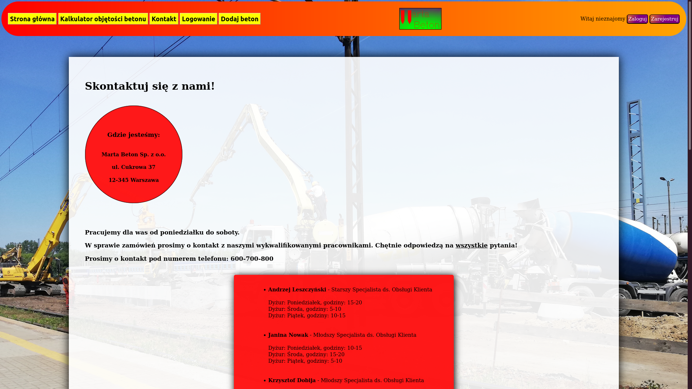
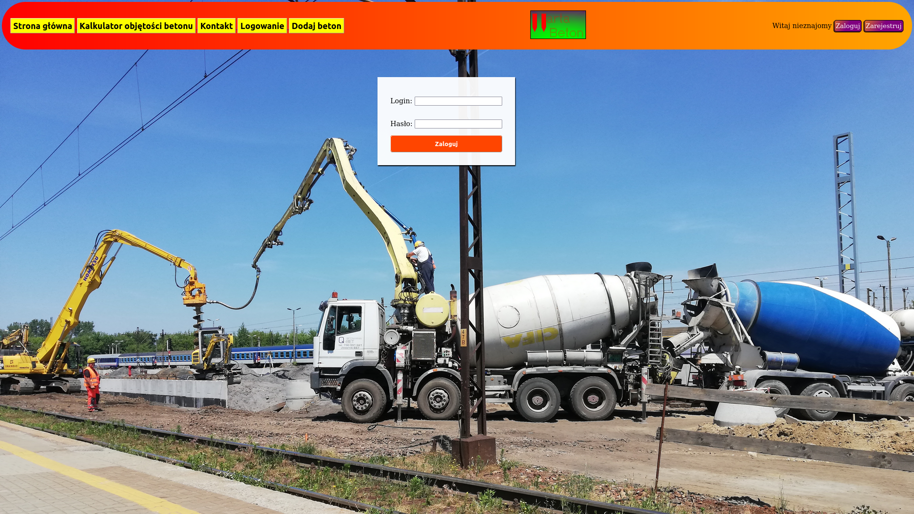
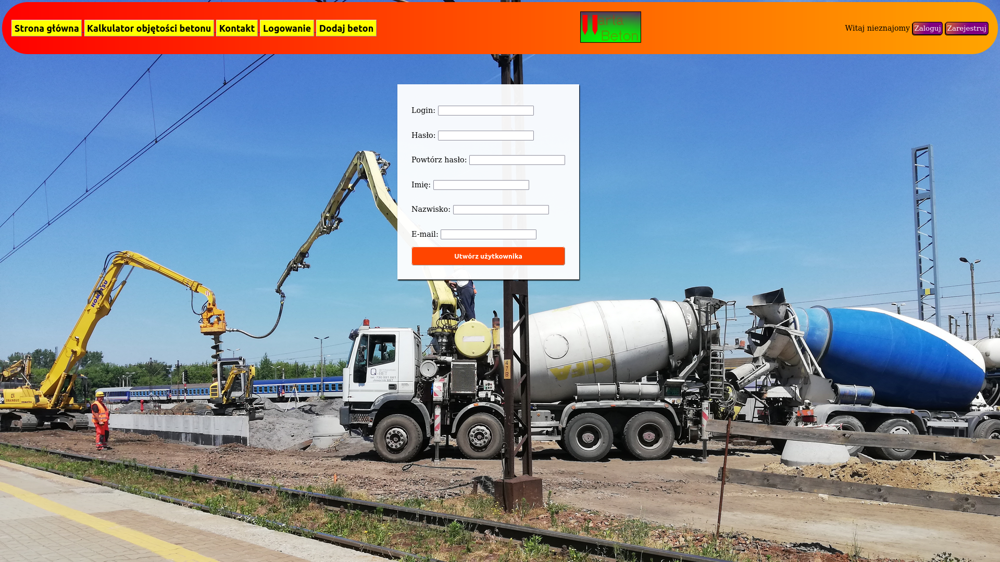

# Concrete Calculator App
Simple calculator where you can calculate the volume of concrete. 

## Table of Contents
* [General info](#general-info)
* [Technologies Used](#technologies-used)
* [Features](#features)
* [Screenshots](#screenshots)
* [Setup](#setup)
* [Usage](#usage)
* [Project Status](#project-status)

## General info
This project was made as a final project of bootcamp. According to my professional experience, I decided to create
a simple calculator of concrete with the possibility of ordering it.  

## Technologies Used
Project is created with:
* Python version: 3.6.9
* Django version: 3.2.11
* Psycopg2-binary version: 2.9.3
* flake8 version: 4.0.1
* pytest version: 6.2.5
* pytest-django version: 4.5.2

## Features
* Main page with company description and gallery. In the header you can choose the option that interest you
(e.g. Kalkulator objętości betonu)
* On the `Kalkulator objętości betonu` page, you choose the shape of concrete (when the mouse hover over the shape,
CSS is working)
* If you choose the type on concrete, you need to fill the form fields (with validation)
* In the next step, you fill the form fields with details of your order
* In the last step you see the summary of your order
* On the `Resgister` page, you can register to application
* On the `Logowanie` page, you can log into application
* On the `Wyloguj` page, you can log out of application
* On the `Kontakt` page, you see persons you can contact with (sorted by name)
* On the `Dodaj beton` page only person with `add_concrete`permission can add a new concrete to database
* Written tests to test the operation of application (100% tests passed)

## Screenshots

### Main page:

### Shape selection:

### Concrete volume calculator (after choosing the shape of concrete):

### Concrete volume calculator (details of order):

### Concrete volume calculator (summary of order):

### Contact page:

### Login page:

### Register page:

## Setup
Project requirements are in _requirements.txt_.  
To get started:
* `pip install -r requirements.txt`
* `python manage.py migrate`
* `python manage.py runserver`

## Usage
* After you clone this repo to your desktop, go to its root directory and run `pip install -r requirements.txt`
to install its dependencies
* When the dependencies are installed, make migrations `python manage.py migrate` and run server 
`python manage.py runserver` to start application
* You will be able to access it at `127.0.0.1:8000`

## Project Status
Project is _complete_.
